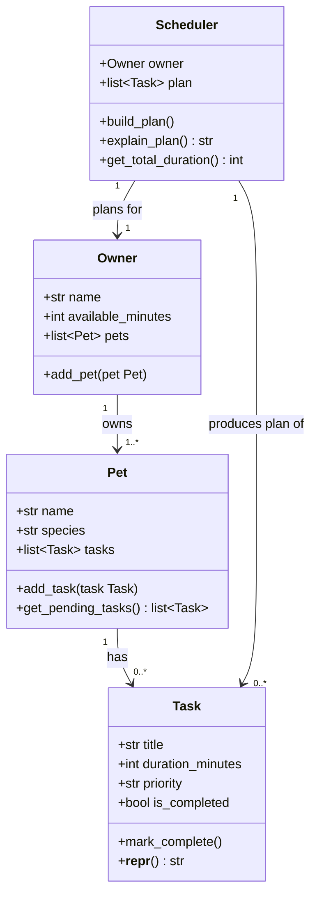

# PawPal+ Project Reflection

## 1. System Design

**a. Initial design**

**Three Core User Actions:**

1. **Add a Pet** — The user enters their name, their pet's name, and selects the pet's species (dog, cat, or other). This registers the pet in the system so that all subsequent tasks and schedules are associated with the correct animal. Without this step, the scheduler has no subject to plan around.

2. **Add a Care Task** — The user describes a task (e.g., "Morning walk"), specifies how long it will take in minutes, and sets a priority level (low, medium, or high). Each task added builds up the pet's daily care list. The priority and duration are the key inputs the scheduler will later use to decide what gets done and in what order.

3. **Generate Today's Schedule** — The user submits the current task list and asks the system to produce an optimized daily plan. The scheduler considers task priorities and durations against the available time window, orders tasks sensibly, and explains why each task was included or excluded. This is the primary output the app delivers to the owner.

- Briefly describe your initial UML design.

PawPal+ is a pet care app that helps owners plan and schedule daily care tasks for their pets. The initial design uses four classes: `Task`, `Pet`, `Owner`, and `Scheduler`. `Task` holds a single care activity with its duration and priority. `Pet` groups tasks belonging to one animal. `Owner` holds the person's available time and their list of pets. `Scheduler` is the planning engine — it takes an owner's pets and available time, selects which tasks fit the day, orders them by priority, and produces an explained plan.

- What classes did you include, and what responsibilities did you assign to each?

| Class | Responsibility |
|---|---|
| `Task` | Holds what needs to be done, how long it takes, its priority, and whether it's complete |
| `Pet` | Groups tasks for one animal; filters to only pending tasks |
| `Owner` | Stores the person's name, available time today, and their list of pets |
| `Scheduler` | Selects and orders tasks that fit within available time; explains the resulting plan |

**b. Design changes**

- Did your design change during implementation?
- If yes, describe at least one change and why you made it.

---

## 2. Scheduling Logic and Tradeoffs

**a. Constraints and priorities**

- What constraints does your scheduler consider (for example: time, priority, preferences)?
- How did you decide which constraints mattered most?

**b. Tradeoffs**

- Describe one tradeoff your scheduler makes.
- Why is that tradeoff reasonable for this scenario?

---

## 3. AI Collaboration

**a. How you used AI**

- How did you use AI tools during this project (for example: design brainstorming, debugging, refactoring)?
- What kinds of prompts or questions were most helpful?

**b. Judgment and verification**

- Describe one moment where you did not accept an AI suggestion as-is.
- How did you evaluate or verify what the AI suggested?

---

## 4. Testing and Verification

**a. What you tested**

- What behaviors did you test?
- Why were these tests important?

**b. Confidence**

- How confident are you that your scheduler works correctly?
- What edge cases would you test next if you had more time?

---

## 5. Reflection

**a. What went well**

- What part of this project are you most satisfied with?

**b. What you would improve**

- If you had another iteration, what would you improve or redesign?

**c. Key takeaway**

- What is one important thing you learned about designing systems or working with AI on this project?
